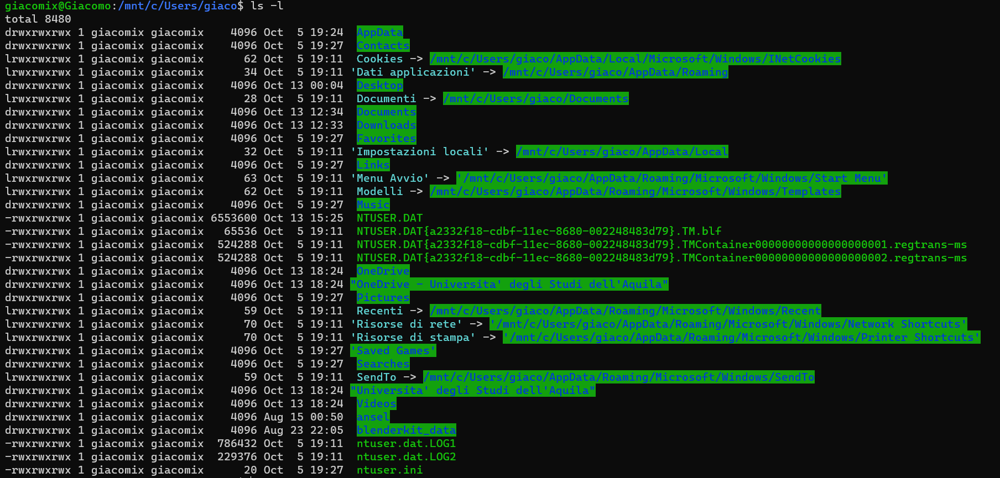
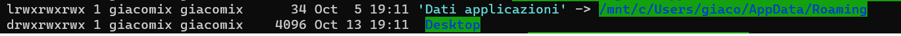
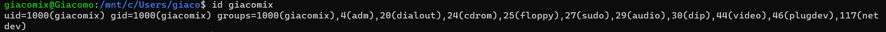
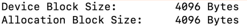

# Comandi Shell

***Per agevolare la scrittura dei comandi, il tasto Tab spesso può essere utilizzato per autocompletare il comando o il nome del file.***
## **<span style="color:red">man</span>**
Restituisce la documentazione per un determinato comando, si utilizza:
```bash
man [options]
```

Per uscire dalla documentazione si utilizza il tasto `q`, mentre per scorrere la documentazione si possono utilizzare le frecce direzionali.

>**Esempio**:  `man ls`

Di seguito un altro uso interessante di `man`, che permette di visualizzare tutti i comandi disponibili tremite una specifica keyword:
```bash
man -k <keyword>
```

## **<span style="color:red">ps</span>**
Visualizza i processi in esecuzione con vari gradi di dettaglio a seconda dei parametri specificati nel coman

```bash
ps [options]
```

## **<span style="color:red">ls</span>**
Mostra il Path relativo alla directory in considerazione

```bash
ls [options] [location]
```

 ### **`ls -l`**<br>
Questo comando restituisce informazioni dettagliate sulle directory, tra cui data di creazione, l'utente che l'ha creata, se è eseguibile, scrivibile e leggibile.

In seguito vediamo la struttura di output del comando `ls -l`:




 col. 1     | col. 2    | col. 3   |col. 4   |col. 5 | col. 6 | col. 7 | col. 8 | col. 9
:----------:|:---------:| :-------:|:-------:| -----:|-------:|-------:|-------:|--------:
file premission       |    numero di hard links del file o il numero di directory entries contenute  | owner name       |  owner group       |  file size     |     Mese di modifica   |  giorno di modifica      |   anno/ora di modifica |     nome del file o directory o link  


Prima della struttura a tabella è presente una riga che inizia con `total` che indica la dimensione totale dei file contenuti nella directory, visualizzata in numero di blocchi ( 512 bytes per blocco) o in bytes.

***All'interno della colonna 1, potrebbero esserci:***

* 2 attributi aggiuntivi alla fine della stringa:
    * **`+`**: ACl (Access Control List) abilitato
    * **`@`**: External Attribute ==> metadata non interpretati dal filesystem

* 2 attributi aggiuntivi all'inizio della stringa:
    * **`l`**: link simbolico
    * **`d`**: directory
>Esempio per il secondo punto:


***File permissions, colonna 1:***

le file permissions sono rappresentate da 3 gruppi di 3 caratteri, che rappresentano i permessi di lettura, scrittura e esecuzione per l'utente(owner), il gruppo e gli altri utenti.

* `r` = leggibile
* `w` = scrivibile
* `x` = eseguibile

La terna è così formata:

    owner | group | others |

Per consultare il comando per modificare i permessi di un file, si può consultare il comando [chmod](#chmod)

<br>

 ### **`ls -a`**<br>
Permette di ottenere l'elenco di tutti i file presenti all'interno della directory in cui viene eseguito, compresi quelli nascosti, normalmente non visibili. (presentano un **"."** prima del nome del file stesso) 

Gli argomenti possono essere combinati per ottenere una visualizzazione completa:


***Nota:*** scrivere `ls -la` o `ls -l -a` è equivalente.

<br>

### **`ls -s`**
Rappresenta il numero di blocchi occupati dai file (*prima colonna*), che poi devono essere moltiplicati per la dimensione del blocco per ottenere la dimensione in bytes

**Vengono presi in considerezione solo i file, non le directory**
>Esempio:
![][def]

### **`ls -1`**
Mostra i file presenti nella directory mettendoli in colonna.

### **`ls -t`**
Con l'argomento `-t` è possibile anche ordinarli in base all'ultima modifica effettuata.


## **<span style="color:red">chmod</span>**
Modifica i permessi di un file o di una directory

```bash
chmod [permissions] [file_name]
```

I permessi possono essere modificati per:
* user ( owner ) : `u`
* group : `g`
* others : `o`
* all : `a`

I permessi possono essere:
* granted : `+`
* revoked : `-`

>Esempio:
>```bash
>chmod u-w pippo.txt
>```
> In questo caso revoco il permesso di scrittura all'utente owner del file `pippo.txt`

>Esempio:
>```bash
>chmod ug+wx pippo.txt
>```
> in questo caso aggiungo allo user e aL gruppo il permesso di scrittura e di esecuzione nel file `pippo.txt`

*Molte volte si utilizzano dei numeri invece delle lettere, vediamo come funzionano:*

| Octal | Binary |
|-------|--------|
| 0     | 0 0 0  |
| 1     | 0 0 1  |
| 2     | 0 1 0  |
| 3     | 0 1 1  |
| 4     | 1 0 0  |
| 5     | 1 0 1  |
| 6     | 1 1 0  |
| 7     | 1 1 1  |


Nel binario ogni bit corrisponde ad un permesso, in questo modo:`r | w | x`

La combinazione di 3 numeri ottali corrisponde ai permessi per un utente, un gruppo o tutti gli altri utenti: `u | g | o`

Quindi alla fine si ottine un numero di 3 cifre, che se vengono sostituite con il binario corrispondente avremo: `rwx | rwx | rwx`

**Naturalmente `1` corrisponde a `+` e `0` a `-`**

>Esempio:
>```bash
>chmod 777 pippo.txt
>```
> in questo caso aggiungo all'utente, al gruppo e a tutti gli altri il permesso di scrittura, lettura ed esecuzione di `pippo.txt`

### Modificare i file ACLs

>Esempio:
>```bash
> chmod +a "user:user1 allow read,write,append" file.txt
>```
> ///


## **<span style="color:red">xattr</span>**
```bash
xattr [options] [file_name]
```
Viene usato per vedere modificare o vedere i metadati di un file, include directory o link simbolici.


## **<span style="color:red">du</span>**
Mostra la dimensione dei file e delle directory su **disco**

```bash 
du [options] [location]
```
Il comando restituisce un numero che deve essere moltiplicato per il blocco minimale allocabile dal filesystem, così da ottenere la dimensione in bytes. (vedi [Filesystem block](#filesystem-block))

Per visualizzare la dimensione dei file e delle directory in un formato più leggibile si può utilizzare il comando `du -h`

>Esempio:
>```bash
>du DISCLAIMER\authors\and\publisher.txt
>```
>
>il comando restituisce un risultato del tipo:
>```bash
>4.0K	DISCLAIMER authors and publisher.txt
>```
><br>

## **<span style="color:red">readlink</span>**
`readlink` viene usato per leggere il path contenuto all'interno di un file che risente del soft-link.
```bash
readlink [options] [file]
```


## **<span style="color:red">id</span>**
Visualizza l'ID dell'utente corrente
    
```bash
id [option]
```

Differenti opzioni:
Differenti opzioni:
* **[login name or user ID]**: visualizza l'ID dell'utente e del gruppo dell'utente specificato
* **-u**: visualizza l'ID dell'utente corrente
* **-un**: visualizza il nome dell'utente corrente
* **-g**: visualizza l'ID del gruppo corrente
* **-gn**: visualizza il nome del gruppo corrente
* **-G**: visualizza tutti gli ID dei gruppi a cui appartiene l'utente corrente
* **-Gn**: visualizza tutti i nomi di tutti i gruppi

>Esempio per la prima opzione: `id <user name>`



<br>

 ## **<span style="color:red">diskutil info / | grep "Block Size</span>**
Visualizza la dimensione del blocco del filesystem

<br>



* **Device Block Size**: è il blocco vero e proprio usato dall'hardware hard drive controller e non può essere cambiato
* **Allocation Block Size**: è usato dal filesystem e viene inizializzato quando la partizione del drive viene formattata

## **<span style="color:red">mkdir</span>**
crea una directory

```bash
mkdir [options] [directory_name]
```

>Esempio:
>```bash
>mkdir ./test
>```
>crea una directory chiamata `test` all'interno della directory corrente
><br>
><br>

### **`mkdir -p`**

```bash
mkdir -p [DirectoryPath]
```

Crea delle directory intermedie nel path


## **<span style="color:red">rmdir</span>**
Rimuove una directory se è vuota

```bash
rmdir [options] [directory_name]
```

<br>

 

### **`rmdir -p <pathname>`**
Rimuove le directory intermedie scritte nel path

>Esempio:
>```bash
>rmdir -p a/c
>```
>in questo caso viene elimitata sia la directory a che c
> <br>**Uguale a:**
>```bash
>rmdir -p a/c a
>```
><br>

<br>

## **<span style="color:red">rm</span>**
Rimuove un singolo file o delle directory non vuote
```bash
rm [options] [file_name]
```


>Esempio di eliminazione di un file all'interno della directory in cui ci troviamo con il terminale:
>```bash
>rm topolino
>```
>

### `rm -r /A`
Vengono eliminate in maniera ricorsiva tutte le sottodirectory e i file, anche non vuoti

***Si consigli di usare l'opzione `-i` quando viene usata l'eliminazione ricorsiva.<br> Il comando `-i` farà si che l'utente veda i file che verranno cancellati e verrà richiesta una conferma dell'azione***

## **`touch`**
`touch` è un comando che permette di impostare la data e ora di ultima modifica e/o di ultimo accesso di uno o più file e directory. In generale, viene usato da molti per creare dei file vuoti rapidamente.
>Esempio: 
>```bash 
>touch pluto.txt
>```
><br>

<br>


## **<span style="color:red">cp</span>**
`cp` è un comando che permette di copiare file e directory

```bash
cp [options] [source] [destination]
```


>Esempio:<br>
> copia di un solo file da una specifica directory a quella corrente definita dal punto **"."**<br>
>```bash
>cp /A/paperino .
>```
>

>Esempio:<br>
> copia di una directory da una specifica directory a quella corrente definita dal punto **"."**<br>
>```bash
>cp -r /A/C .
>```
>

### **`cp -r`**
Per copiare una directory è necessario utilizzare l'opzione `-r` che permette di copiare anche le directory interne , in poche parole `-r`chiede di fare una copia **ricorsiva**

## **`mv`**
`mv` è un comando che permette di spostare file e directory

```bash
mv [options] [source] [destination]
```

***In questo caso le directory e i relativi sottofile e sottodirectory vengono spostate anche senza l'opzione `-r`***

>Esempio:<br>
> spostamento di una directory da una specifica directory a quella corrente definita dal punto **"."**<br>
>```bash
>mv /A/C .
>```
>

<br>

Per rinominare un file o directory si può utilizzare il comando `mv` con la seguente sintassi:
```bash
mv [source] [destination]
```
In cui `source` e `destination` sono rispettivamente il file o directory da rinominare e il nuovo nome che si vuole dare, ed entrambe si trovano nella stessa directory.

>Esempio:<br>
> ```bash
>mv topolino.txt yupi.txt
>```
>
><br>
> Nella shell apparirà così:
>
>È stato creato prima un file di testo chiamato `topolino` e poi rinominato in `yupi`
>
><br>


<br>