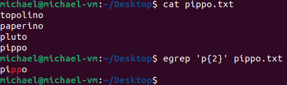

# Espressioni Regolari

Similmente alle **wildcards** per i path, le espressioni regolari permettono di creare dei pattern per accedere e leggere linee di file di testo (Esempio: identificare tutte le stringhe che rappresentano URLs, linee di commento, indirizzi e-mail).

Esistono due tipi di espressioni regolari:

* **Basic Regular Expressions (BRE)**
* **Extended Regular Expressions (ERE)**

Un'espressione regolare moderna si compone di uno o più rami (*branch*) non vuoti separati da una pipe **|**. Un **branch** è composto da uno o più pezzi (*piece*) concatenati. Seleziona una corrispondenza per il primo pezzo, seguito da una corrispondenza per il secondo, ecc.
Un **piece** è una preposizione atomica (**atom**) possibilmente seguita da caratteri speciali quali:

* **`<atomo>`\*** - il precedente atomo matcha 0 o più volte
* **`<atomo>`+** - il precedente atomo matcha 1 o più volte
* **`<atomo>`?** - il precedente atomo matcha 0 o solo 1 volta

> Esempio:
>  
> 
> **NOTA:** Mentre per il **+** e **\*** il match è multiplo, il **?** matcha una singola volta ma lo fa in più istanze, pertanto il risultato atteso dal **?** e dal **\*** è lo stesso.

* **`<atomo>`{n}** - il precedente atomo matcha esattamente n volte
> Esempio:
>  
> 

* **`<atomo>`{n,m}** - il precedente atomo matcha al meno *n* volte a al più *m* volte

* **`<atomo>`{n,}** - il precedente atomo matcha almeno n volte

* **(reg exp)** - matcha l'espressione regolare racchiusa nelle parentesi tonde

* **()** - matcha la stringa vuota

> Esempio:
>  
> .png)

* **.** - matcha qualsiasi carattere

* **^** - matcha la stringa nulla all'inizio di una riga di testo

* **$** - matcha la stringa nulla alla fine di una riga di testo

* **\\** - se seguito da un carattere con meta-significato (come *, +, ecc...), matcha quel carattere come se fosse un carattere normale

Un atomo è rappresentabile anche come espressione tra []. 

* **[agd]** - matcha ognuno dei caratteri presenti all'interno delle [] considerandoli come se fossero a se stanti

* **[^agd]** - matcha ogni altro carattere differente da quelli specificati all'interno delle []

* **[c-f]** - matcha i caratteri compresi nel range specificato all'interno delle []. Significa, quindi, che matcha i caratteri 'c', 'd', 'e' ed 'f'.

> Esempio:
>  
> 

--------------------
[Return Home](/README.md)
 
[Return Filters and Pipelines](/Filters_Redirections_Pipelines.md)