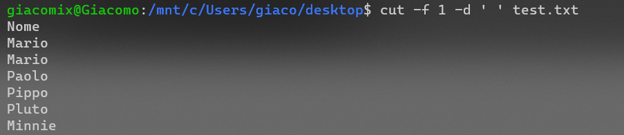
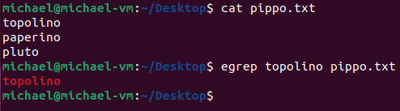

* [Introdizione](#filters-redirection-e-pipelines)
* [Filtri](#filtri)
* [Pipelines e redirezione](#pipeline-e-redirezione)


# Filters, Redirection e Pipelines
* Il **filtro** è un programma o una subrutine che prende dati in standard input e "scrive" il risultato allo standard output. Parte più importante è che il filtro **NON** modifica il file di input.
* La **redirection** è un meccanismo che permette di cambiare il flusso di dati in ingresso e in uscita di un programma tramite l'utilizzo di `>` e `<`
* Le **pipelines** possono anche essere utilizzate insieme ai filtri. Una pipeline è una sequenza di comandi collegati tramite pipe `|` che permette di passare il risultato di un comando come input di un altro comando.

# Filtri

## **<span style="color:red">head</span>**
`head` è un filtro che permette di visualizzare le prime righe di un file di testo

```bash
head [options] [file_name]
```

**Per default sono visualizzare le prime 10 linee**

### **`head -n`**

```bash
head -n [number] [file_name]
```
Il `number` indica il numero di **righe** che si vogliono visualizzare


### **`head -c`**
```bash
head -c [number] [file_name]
```
Il `number` indica il numero di **bytes** che si vogliono visualizzare ( 1 byte = 1 char )

## **<span style="color:red">tail</span>**
`tail` è un filtro che permette di visualizzare le ultime righe di un file di testo

```bash
tail [options] [file_name]
```
Le opzioni sono le stesse di [head](#head--n), unica cosa è che i bytes e i caratteri verranno conteggiati dalla fine verso l'inizio del file

## **<span style="color:red">sort</span>**
`sort` è un filtro che permette di ordinare testo e file binari ( di default ordina in ordine alfabetico )

**Verrà fatto il sort anche delle linee vuote, che verranno inserite a inizio file**

```bash
sort [options] [file_name]
```
## **<span style="color:red">nl</span>**
`nl` è un filtro che permette di numerare le righe di un file di testo

```bash
nl [options] [file_name]
```

> Esempio:
>```bash
>nl -s '. ' -w 10 persone.txt
>```
>Esegue una formattazione personalizzata <br>
> * Il comando `-w 10` indica che verrà tabulato di 10 <br>
> * Il comando `-s '. '` indica che verrà inserito un punto e uno spazio tra il numero di riga e il testo
> 

## **<span style="color:red">wc</span>**
`wc` è un filtro che permette di contare le righe, le parole e i caratteri di un file di testo

```bash
wc [options] [path]
```
>Esempio:
>
>L'output di default è così composto: <br>
> `linee | parole | caratteri | nome del file`

Tipi di `options` possibili:
* `-c`: visualizza solo il numero di bytes
* `-m`: visualizza solo il numero di caratteri
* `-l`: visualizza solo il numero di righe
* `-w`: visualizza solo il numero di parole

## **<span style="color:red">cut</span>**
`cut` è un filtro che permette di selezionare parti di una riga di testo separati da un delimitatore

```bash
cut [options] [file_name]
```

Prendendo come testo il seguente file:<br>


Eseguiamo questo comando:
```bash
cut —f <selezione "colonne"> -d <separatore> test.txt
```
Vediamo cosa succede sostituendo i parametri tra <>:

Essendo che nel file di testo il `;` non è presente il comando restituisce tutto il file senza nessuna separazione

<br>


Essendo che nel file il testo è separato da `spazi` il comando mi restituisce tutti i caratteri per ogni riga fino al primo spazio

<br>


Essendo che nel file il testo è separato da `spazi` il comando mi restituisce tutti i caratteri per ogni riga fino al secondo spazio


## **<span style="color:red">uniq</span>**
`uniq` è un filtro che permette di rimuovere le righe duplicate di un file di testo

**Attenzione: le righe duplicate devono essere consecutive, cioè non separate da spazi bianchi**

```bash
uniq [file_name]
```

## **<span style="color:red">tac</span>**

`tac` è un filtro che permette di visualizzare il contenuto di un file di testo in ordine inverso

```bash
tac [file_name]
```


## **<span style="color:red">diff</span>**
Con `diff` è possibile confrontare due file di testo e visualizzare le differenze linea per linea

```bash
diff [options] [file_name_1] [file_name_2] 
```


La prima rida deve essere letta nel seguente modo:<br>

```righe del primo file | lettera | righe del secondo file```

La `lettera` può essere:
* `a`: riga aggiunta
* `d`: riga eliminata
* `c`: riga modificata

Inoltre:
* `<` indica le righe del primo file
* `>` indica le righe del secondo file
* `---` è il separatore fra files

>Esempio di lettura della prima riga:<br>
>`1,7c1,7`<br>
> il range di righe *1* - *7* del **primo file** è stato modificato e sostituito il rispettivo range *1* - *7* del **secondo file**

## **<span style="color:red">egrep</span>**

```bash
egrep [options] [pattern] [file_name]
```

Il comando **grep** o **egrep** (extended grep) cerca nel file di testo una riga di testo che corrisponde ad uno o più patterns passati come parametro<br>
**Si usa perlopiù con le [Espressioni Regolari](/Espressioni_regolari.md)**

> Esempio:
> <br>
> 


## **<span style="color:red">sed</span>**

Si tratta di un comando per cercare e rimpiazzare un'espressione con un'altra. Il formato è il seguente:

> Esempio:
> ```bash
> sed [command] [file_name]
> ```
> **NOTA:** **s** sta per sostituisci e **g** per globalmente, senza **g** il comando sostituisce solo la ***prima istanza*** della riga di testo

* **-e** - se usato prima dell'espressione per rimpiazzare, è utile per combinarne più insieme

> Esempio:
> ```bash
> sed -e 's/a/A/' -e 's/b/B/' persone.txt
> ```
> Rimpiazza le lettere minuscole a e b con le loro lettere maiuscole

Ovviamente, è possibile utilizzare questo comando in combinazione con le espressioni regolari.

# Pipeline e redirezione

I flussi di dati nella shell si servono di canali di comunicazione. Specificatamente, si parla di:

* **STDIN (0)** - è lo standard input

* **STDOUT (1)** - è lo standard output

* **STDERR (2)** - è lo standard error

Lo standard error viene reindirizzato di default nello standard output:

> Esempio:
> <br>
> 

Per rdirezionare manualmente l'input e l'output si utilizzano i seguenti operatori:

* **>** - permette di redirezionare l'output di un programma o di un comando in un file, piuttosto che stamparlo a schermo.

--------------------
[Return Home](/README.md)
