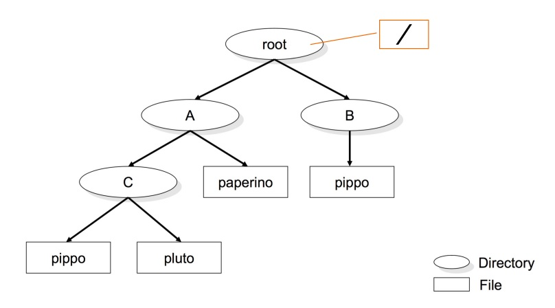
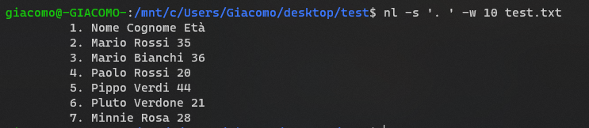
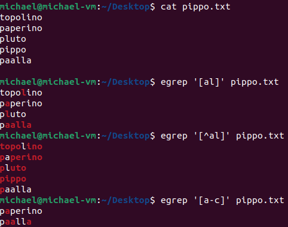

# INDICE

* [Shell](#shell)
* [Da dove prende i comandi il terminale?](#da-dove-prende-i-comandi-il-terminale)
* [UNIX file system](#unix-file-system)
* [Working directory](#working-directory)
* [Filesystem block](#filesystem-block)
* [Wildcards](/Wildcards.md)
* [Comandi Shell](/comandi_shell.md)
* [Comandi per scrittura su file](/Comandi_files.md))
* [Filters, Redirection e Pipelines](#filters-redirection-e-pipelines)
* [Espressioni Regolari](#espressioni-regolari)
* [Parametri](#parametri)
* [Vocabolario](#vocabolario)

# Shell
I sistemi UNIX mettono a disposizione differenti tipi di Shell, elencati di seguito:
* sh
* bash
* csh
* tcsh
* ksh
* zsh

Per visualizzare il tipo di shell che stiamo utilizzando possiamo eseguire uno dei seguenti comandi nel Terminale: 

```bash
echo $0

echo $SHELL

which $SHELL
```

Per visualizzare le shell disponibili nel sistema che stiamo utilizzando, possiamo utilizzare il seguente comando: 

```bash
cat /etc/shells
```
Il comando `cat` non è l'unico che consente di visualizzare file, in seguito verranno introdotti altri comandi (come ad esempio `nano`) che oltre a consentire la visualizzazione dei file, ne consentono anche la modifica.

Per cambiare shell basta scrivere il nome della shell che si vuole utilizzare
>Ad esempio: 
>```bash
>zsh
>```
><br>

<br>

# Da dove prende i comandi il terminale?
Quando scriviamo un comando nel terminale, il sistema operativo cerca l'implementazione del comando all'interno di un set predefinito di *directories*, specificate all'interno della variabile `$PATH`.

# UNIX file system


Il file system di UNIX è una struttura gerarchica formata da files.

Il file principale **root** è una directory, ossia un file che contiene altri files. 

La directory ***root*** in UNIX viene rappresentata con il simbolo `/`, segue un esempio per chiarire le idee riguardo le directory in generale:


>Analizziamo il Path ```/home/utente```. Ci troviamo nella directory `utente` che è una sottocartella di `home` che a sua volta è una sottocartella di `/`
>

Per navigare tra le directory si utilizza il comando:
```bash
cd <directory name>
```
Per tornare alla directory precedente si utilizza il comando:
```bash
cd ..
```
Per tornare alla directory principale si utilizza il comando:
```bash
cd ~
```

# Working directory

Esistono due tipologie di directory:
* **Absolute path**: indica la posizione di un file rispetto alla directory principale `/`
* **Relative path**: indica la posizione di un file rispetto alla directory in cui ci troviamo


Per cambiare la directory di lavoro si utilizza una system-call, ossia la funzione `chdir`.

Le ***directories*** sono dei files che contengono `directory entries`, ossia dei files che contengono altri files; la dimensione che viene visualizzata è quella usata per immagazzinare le *meta information* (directory entries) per quella directory.<br>
Per visualizzare la dimensione su **disco** usare il comando [`du`](#du)

# Filesystem block
* `Che cos'è un blocco?` È una sequenza di bytes / bit

* `La dimensione di un blocco è l'unità di lavoro del filesystem`; la sua importanza è rilevante dato che viene impiegata dal filesystem per le operazioni di lettura/scrittura dei dati.

* La dimensione minima che un blocco può avere su un disco fisso è di 16 bytes. 

* Aumentare la dimensione di un blocco consente di migliorare le prestazioni di Input/Output sui file di grandi dimensioni, in quanto le operazioni di lettura/scrittura vengono concentrate per un periodo di tempo maggiore su un singolo blocco prima di spostarsi al successivo!

* **Problema**: i file di piccole dimensioni come riportato di seguito, occupano più spazio di quanto previsto, questo perché i blocchi che li compongono sono più grandi!

  Di seguito una immagine esplicativa! Il file dovrebbe pesare 1KB ma sul disco pesa 4KB!


  


# Filters, Redirection e Pipelines
* Il **filtro** è un programma o una subrutine che prende dati in standard input e "scrive" il risultato allo standard output. Parte più importante è che il filtro **NON** modifica il file di input.
* La **redirection** è un meccanismo che permette di cambiare il flusso di dati in ingresso e in uscita di un programma tramite l'utilizzo di `>` e `<`
* Le **pipelines** possono anche essere utilizzate insieme ai filtri. Una pipeline è una sequenza di comandi collegati tramite pipe `|` che permette di passare il risultato di un comando come input di un altro comando.

## **<span style="color:red">head</span>**
`head` è un filtro che permette di visualizzare le prime righe di un file di testo

```bash
head [options] [file_name]
```

**Per default sono visualizzare le prime 10 linee**

### **`head -n`**

```bash
head -n [number] [file_name]
```
Il `number` indica il numero di righe che si vogliono visualizzare


### **`head -c`**
```bash
head -c [number] [file_name]
```
Il `number` indica il numero di bytes che si vogliono visualizzare ( 1 byte = 1 char )

## **<span style="color:red">tail</span>**
`tail` è un filtro che permette di visualizzare le ultime righe di un file di testo

```bash
tail [options] [file_name]
```
Le opzioni sono le stesse di [head](#head--n), unica cosa è che i bytes e i caratteri verranno conteggiati dalla fine verso l'inizio del file

## **<span style="color:red">sort</span>**
`sort` è un filtro che permette di ordinare testo e file binari ( di default ordina in ordine alfabetico )

**Verrà fatto il sort anche delle linee vuote, che verranno inserite a inizio file**

```bash
sort [options] [file_name]
```

## **<span style="color:red">nl</span>**
`nl` è un filtro che permette di numerare le righe di un file di testo

```bash
nl [options] [file_name]
```

> Esempio:
>```bash
>nl -s '. ' -w 10 persone.txt
>```
>Esegue una formattazione personalizzata <br>
> * Il comando `-w 10` indica che verrà tabulato di 10 <br>
> * Il comando `-s '. '` indica che verrà inserito un punto e uno spazio tra il numero di riga e il testo
> 

## **<span style="color:red">egrep</span>**

Il comando **grep** o **egrep** (extended grep) cerca nel file di testo una riga di testo che corrisponde ad uno o più patterns passati come parametro

> Esempio:
> <br>
> 

# Espressioni Regolari

Similmente alle **wildcards** per i path, le espressioni regolari permettonop di creare dei pattern per accedere e leggere linee di file di testo (Esempio: identificare tutte le stringhe che rappresentano URLs, linee di commento, indirizzi e-mail).

Esistono due tipi di espressioni regolari:

* **Basic Regular Expressions (BRE)**
* **Extended Regular Expressions (ERE)**

Un'espressione regolare moderna si compone di uno o più rami (*branch*) non vuoti separati da una pipe **|**. Un **branch** è composto da uno o più pezzi (*piece*) concatenati. Seleziona una corrispondenza per il primo pezzo, seguito da una corrispondenza per il secondo, ecc.
Un **piece** è una preposizione atomica (**atom**) possibilmente seguita da caratteri speciali quali:

* **\*** - il precedente atomo matcha 0 o più volte
* **+** - il precedente atomo matcha 1 o più volte
* **?** - il precedente atomo matcha 0 o solo 1 volta

> Esempio:
> <br>
> 
> **NOTA:** Mentre per il **+** e **\*** il match è multiplo, il **?** matcha una singola volta ma lo fa in più istanze, pertanto il risultato atteso dal **?** e dal **\*** è lo stesso.

* **{n}** - il precedente atomo matcha esattamente n volte
> Esempio:
> <br>
> 

* **{n,m}** - il precedente atomo matcha al meno n volte a al più m volte

* **{n,}** - il precedente atomo matcha almeno n volte

* **(reg exp)** - matcha l'espressione regolare racchiusa nelle parentesi tonde

* **()** - matcha la stringa vuota

> Esempio:
> <br>
> .png)

* **.** - matcha qualsiasi carattere

* **^** - matcha la stringa nulla all'inizio di una riga di testo

* **$** - matcha la stringa nulla alla fine di una riga di testo

* **\\** - se seguito da un carattere con meta-significato (come *, +, ecc...), matcha quel carattere come se fosse un carattere normale

Un atomo è rappresentabile anche come espressione tra []. 

* **[agd]** - matcha ognuno dei caratteri presenti all'interno delle [] considerandoli come se fossero a se stanti

* **[^agd]** - matcha ogni altro carattere differente da quelli specificati all'interno delle []

* **[c-f]** - matcha i caratteri compresi nel range specificato all'interno delle []. Significa, quindi, che matcha i caratteri 'c', 'd', 'e' ed 'f'.

> Esempio:
> <br>
> 


# Parametri

I parametri qui sotto elencati sono quelli più utilizzati, per una lista completa si può consultare la documentazione con il comando [man](#man)

* `-l`: mostra una versione dettagliata del comando
* `-r`: esegue il comando in maniera ricorsiva

# Vocabolario

* **Soft links**: Chiamati anche link simbolici, sono dei file che puntano al file vero e proprio e conservano dentro di loro il nome del file a cui puntano ( in Windows lo puoi pensare come un file "Collegamento")


* **Hard Link**: è l'equivalente del file che si trova nell'HDD. Sono reference o puntatori verso punti nell'hdd. <br> La caratteristica principale dell'`Hard Link` che lo differisce dal `Soft Link` è il fatto che tramite la cancellazione del file originale non andremo a intaccare l'`Hard Link`, mentre invece il `Soft Link` diventerebbe inutilizzabile.


* **Path**: una stringa che identifica la posizione di una specifica directory o file.

* **Directory entry**: un file che contiene informazioni su un file o una directory, come ad esempio il nome del file, la data di creazione, la dimensione, ecc.

[def]: img/ls-s.png
[def2]: £
