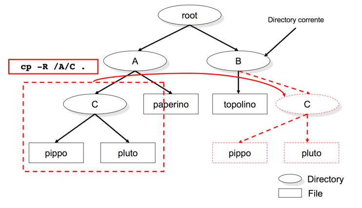
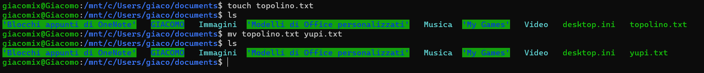

# INDICE

* [Shell](#shell)
* [Da dove prende i comandi il terminale?](#da-dove-prende-i-comandi-il-terminale)
* [UNIX file system](#unix-file-system)
* [Working directory](#working-directory)
* [Filesystem block](#filesystem-block)
* [Wildcards](#wildcards)
* [Comandi Shell](#comandi-shell)
* [Comandi per scrittura su file](#comandi-per-file)
* [Filters, Redirection e Pipelines](#filters-redirection-e-pipelines)
* [Parametri](#parametri)
* [Vocabolario](#vocabolario)
* [Espressioni Regolari](#espressioni-regolari)

# Shell
I sistemi UNIX mettono a disposizione differenti tipi di Shell, elencati di seguito:
* sh
* bash
* csh
* tcsh
* ksh
* zsh

Per visualizzare il tipo di shell che stiamo utilizzando possiamo eseguire uno dei seguenti comandi nel Terminale: 

```bash
echo $0

echo $SHELL

which $SHELL
```

Per visualizzare le shell disponibili nel sistema che stiamo utilizzando, possiamo utilizzare il seguente comando: 

```bash
cat /etc/shells
```
Il comando `cat` non è l'unico che consente di visualizzare file, in seguito verranno introdotti altri comandi (come ad esempio `nano`) che oltre a consentire la visualizzazione dei file, ne consentono anche la modifica.

Per cambiare shell basta scrivere il nome della shell che si vuole utilizzare
>Ad esempio: 
>```bash
>zsh
>```
><br>

<br>

# Da dove prende i comandi il terminale?
Quando scriviamo un comando nel terminale, il sistema operativo cerca l'implementazione del comando all'interno di un set predefinito di *directories*, specificate all'interno della variabile `$PATH`.

# UNIX file system


Il file system di UNIX è una struttura gerarchica formata da files.

Il file principale **root** è una directory, ossia un file che contiene altri files. 

La directory ***root*** in UNIX viene rappresentata con il simbolo `/`, segue un esempio per chiarire le idee riguardo le directory in generale:


>Analizziamo il Path ```/home/utente```. Ci troviamo nella directory `utente` che è una sottocartella di `home` che a sua volta è una sottocartella di `/`
>

Per navigare tra le directory si utilizza il comando:
```bash
cd <directory name>
```
Per tornare alla directory precedente si utilizza il comando:
```bash
cd ..
```
Per tornare alla directory principale si utilizza il comando:
```bash
cd ~
```

# Working directory

Esistono due tipologie di directory:
* **Absolute path**: indica la posizione di un file rispetto alla directory principale `/`
* **Relative path**: indica la posizione di un file rispetto alla directory in cui ci troviamo


Per cambiare la directory di lavoro si utilizza una system-call, ossia la funzione `chdir`.

Le ***directories*** sono dei files che contengono `directory entries`, ossia dei files che contengono altri files; la dimensione che viene visualizzata è quella usata per immagazzinare le *meta information* (directory entries) per quella directory.<br>
Per visualizzare la dimensione su **disco** usare il comando [`du`](#du)

# Filesystem block
La grandezza dei blocchi rappresenta la quantità di dati che il filesystem usa per leggere e scrivere data

Quindi potrebbe succedere che un file, dalla dimenzione di 1 kb, su disco vada ad occupare 4kb, essendo quello il blocco minimo allocabile dal filesystem


* Un **larger block size** aiuta ad aumentar ele performance sul disco nelle operazioni I/O. Questo perchè il disco può leggere e scrivere dati per un più lungo periodo di tempo sullo stesso blocco, per poi passare alla ricerca del blocco successivo
* Allo stesso tempo se abbiamo molti file piccoli, come succede in `/etc`, avremmo uno spreco di spazio essendo che in uno stesso blocco non possono esserci dati di più file

# Wildcards

*IMPORTANTE!*
*Le wildcards sono tradotte dalla shell prima di essere passate al comando, e quindi non sono parte del comando stesso* 


permettono la definizione di pattern e si possono utilizzare **solo nei path delle varie shell** con i suoi [comandi](#comandi-shell)

* `*` : restituisce in output tutti i path 
    * `<parola/lettera/wildcard>*`  : restituisce tutte i path che **iniziano** con quella `<parola>` o `<lettera>` o  `<wildcard>`  
    * `*<parola/lettera/wildcard>` : restituisce tutte i path che **terminano** con quella `<parola>` o  `<lettera>` o `<wildcard>`


* `?` : restituisce tutti i path che hanno **un solo carattere** 
    * `<parola/lettera/wildcard?>` : restituisce tutti i path che dopo la `<parola>` o  `<lettera>` o `<wildcard>` terminano con **un solo carattere**
    * `?<parola/lettera/wildcard>` : restituisce tutti i path che prima della `<parola>` o  `<lettera>` o `<wildcard>`  iniziano con **un solo** carattere 


* `[]` : restituisce tutti i path formati da **un solo carattere** di un certo **range di caratteri** ( di solito si utilizza insieme a `*`) 
    * `[agd]` : restituisce tutte le directory formate da **una** delle lettere all'interno
    * `[a-g]` : restituisce tutte le directory formate da **una** delle lettere all'interno del range (estremi inclusi)
    * `[^a-d]` oppure `[!a-d]`: restituisce tutte le directory formate da **una** delle lettere che **non sono nel range** (**reverse range**)


* `{}` : restituisce tutti i path formati da delle combinazioni di wildcard e di parole scritte all'interno delle parentesi (si possono usare più combinazioni basta che vengano divise da una `,`)


* `\` : si usa prima di una wildcard per farla leggere come stringa (anche lo stesso \ (backslash))
    * per scrivere il carattere `\` si usa `\\`

# Comandi Shell

***Per agevolare la scrittura dei comandi, il tasto Tab spesso può essere utilizzato per autocompletare il comando o il nome del file.***
## **<span style="color:red">man</span>**
Restituisce la documentazione per un determinato comando, si utilizza:
```bash
man [options]
```

Per uscire dalla documentazione si utilizza il tasto `q`, mentre per scorrere la documentazione si possono utilizzare le frecce direzionali.

>**Esempio**:  `man ls`

Di seguito un altro uso interessante di `man`, che permette di visualizzare tutti i comandi disponibili tremite una specifica keyword:
```bash
man -k <keyword>
```

## **<span style="color:red">ps</span>**
Visualizza i processi in esecuzione con vari gradi di dettaglio a seconda dei parametri specificati nel coman

```bash
ps [options]
```

## **<span style="color:red">ls</span>**
Mostra il Path relativo alla directory in considerazione

```bash
ls [options] [location]
```

 ### **`ls -l`**<br>
Questo comando restituisce informazioni dettagliate sulle directory, tra cui data di creazione, l'utente che l'ha creata, se è eseguibile, scrivibile e leggibile.

In seguito vediamo la struttura di output del comando `ls -l`:


 col. 1     | col. 2    | col. 3   |col. 4   |col. 5 | col. 6 | col. 7 | col. 8 | col. 9
:----------:|:---------:| :-------:|:-------:| -----:|-------:|-------:|-------:|--------:
file premission       |    numero di hard links del file o il numero di directory entries contenute  | owner name       |  owner group       |  file size     |     Mese di modifica   |  giorno di modifica      |   anno/ora di modifica |     nome del file o directory o link  


Prima della struttura a tabella è presente una riga che inizia con `total` che indica la dimensione totale dei file contenuti nella directory, visualizzata in numero di blocchi ( 512 bytes per blocco) o in bytes.

***All'interno della colonna 1, potrebbero esserci:***

* 2 attributi aggiuntivi alla fine della stringa:
    * **`+`**: ACl (Access Control List) abilitato
    * **`@`**: External Attribute ==> metadata non interpretati dal filesystem

* 2 attributi aggiuntivi all'inizio della stringa:
    * **`l`**: link simbolico
    * **`d`**: directory
>Esempio per il secondo punto:


***File permissions, colonna 1:***

le file permissions sono rappresentate da 3 gruppi di 3 caratteri, che rappresentano i permessi di lettura, scrittura e esecuzione per l'utente(owner), il gruppo e gli altri utenti.

* `r` = leggibile
* `w` = scrivibile
* `x` = eseguibile

La terna è così formata:

    owner | group | others |

Per consultare il comando per modificare i permessi di un file, si può consultare il comando [chmod](#chmod)

<br>

 ### **`ls -a`**<br>
Permette di ottenere l'elenco di tutti i file presenti all'interno della directory in cui viene eseguito, compresi quelli nascosti, normalmente non visibili. (presentano un **"."** prima del nome del file stesso) 

Gli argomenti possono essere combinati per ottenere una visualizzazione completa:


***Nota:*** scrivere `ls -la` o `ls -l -a` è equivalente.

<br>

### **`ls -s`**
Rappresenta il numero di blocchi occupati dai file (*prima colonna*), che poi devono essere moltiplicati per la dimensione del blocco per ottenere la dimensione in bytes

**Vengono presi in considerezione solo i file, non le directory**
>Esempio:
![][def]

### **`ls -1`**
Mostra i file presenti nella directory mettendoli in colonna.

### **`ls -t`**
Con l'argomento `-t` è possibile anche ordinarli in base all'ultima modifica effettuata.


## **<span style="color:red">chmod</span>**
Modifica i permessi di un file o di una directory

```bash
chmod [permissions] [file_name]
```

I permessi possono essere modificati per:
* user ( owner ) : `u`
* group : `g`
* others : `o`
* all : `a`

I permessi possono essere:
* granted : `+`
* revoked : `-`

>Esempio:
>```bash
>chmod u-w pippo.txt
>```
> In questo caso revoco il permesso di scrittura all'utente owner del file `pippo.txt`

>Esempio:
>```bash
>chmod ug+wx pippo.txt
>```
> in questo caso aggiungo allo user e aL gruppo il permesso di scrittura e di esecuzione nel file `pippo.txt`

*Molte volte si utilizzano dei numeri invece delle lettere, vediamo come funzionano:*

| Octal | Binary |
|-------|--------|
| 0     | 0 0 0  |
| 1     | 0 0 1  |
| 2     | 0 1 0  |
| 3     | 0 1 1  |
| 4     | 1 0 0  |
| 5     | 1 0 1  |
| 6     | 1 1 0  |
| 7     | 1 1 1  |


Nel binario ogni bit corrisponde ad un permesso, in questo modo:`r | w | x`

La combinazione di 3 numeri ottali corrisponde ai permessi per un utente, un gruppo o tutti gli altri utenti: `u | g | o`

Quindi alla fine si ottine un numero di 3 cifre, che se vengono sostituite con il binario corrispondente avremo: `rwx | rwx | rwx`

**Naturalmente `1` corrisponde a `+` e `0` a `-`**

>Esempio:
>```bash
>chmod 777 pippo.txt
>```
> in questo caso aggiungo all'utente, al gruppo e a tutti gli altri il permesso di scrittura, lettura ed esecuzione di `pippo.txt`

### Modificare i file ACLs

>Esempio:
>```bash
> chmod +a "user:user1 allow read,write,append" file.txt
>```
> ///


## **<span style="color:red">xattr</span>**
```bash
xattr [options] [file_name]
```
Viene usato per vedere modificare o vedere i metadati di un file, include directory o link simbolici.


## **<span style="color:red">du</span>**
Mostra la dimensione dei file e delle directory su **disco**

```bash 
du [options] [location]
```
Il comando restituisce un numero che deve essere moltiplicato per il blocco minimale allocabile dal filesystem, così da ottenere la dimensione in bytes. (vedi [Filesystem block](#filesystem-block))

Per visualizzare la dimensione dei file e delle directory in un formato più leggibile si può utilizzare il comando `du -h`

>Esempio:
>```bash
>du DISCLAIMER\authors\and\publisher.txt
>```
>
>il comando restituisce un risultato del tipo:
>```bash
>4.0K	DISCLAIMER authors and publisher.txt
>```
><br>

## **<span style="color:red">readlink</span>**
`readlink` viene usato per leggere il path contenuto all'interno di un file che risente del soft-link.
```bash
readlink [options] [file]
```


## **<span style="color:red">id</span>**
Visualizza l'ID dell'utente corrente
    
```bash
id [option]
```

Differenti opzioni:
Differenti opzioni:
* **[login name or user ID]**: visualizza l'ID dell'utente e del gruppo dell'utente specificato
* **-u**: visualizza l'ID dell'utente corrente
* **-un**: visualizza il nome dell'utente corrente
* **-g**: visualizza l'ID del gruppo corrente
* **-gn**: visualizza il nome del gruppo corrente
* **-G**: visualizza tutti gli ID dei gruppi a cui appartiene l'utente corrente
* **-Gn**: visualizza tutti i nomi di tutti i gruppi

>Esempio per la prima opzione: `id <user name>`


<br>

 ## **<span style="color:red">diskutil info / | grep "Block Size</span>**
Visualizza la dimensione del blocco del filesystem

<br>


* **Device Block Size**: è il blocco vero e proprio usato dall'hardware hard drive controller e non può essere cambiato
* **Allocation Block Size**: è usato dal filesystem e viene inizializzato quando la partizione del drive viene formattata

## **<span style="color:red">mkdir</span>**
crea una directory

```bash
mkdir [options] [directory_name]
```

>Esempio:
>```bash
>mkdir ./test
>```
>crea una directory chiamata `test` all'interno della directory corrente
><br>
><br>

### **`mkdir -p`**

```bash
mkdir -p [DirectoryPath]
```

Crea delle directory intermedie nel path


## **<span style="color:red">rmdir</span>**
Rimuove una directory se è vuota

```bash
rmdir [options] [directory_name]
```

<br>

 

### **`rmdir -p <pathname>`**
Rimuove le directory intermedie scritte nel path

>Esempio:
>```bash
>rmdir -p a/c
>```
>in questo caso viene elimitata sia la directory a che c
> <br>**Uguale a:**
>```bash
>rmdir -p a/c a
>```
><br>

<br>

## **<span style="color:red">rm</span>**
Rimuove un singolo file o delle directory non vuote
```bash
rm [options] [file_name]
```


>Esempio di eliminazione di un file all'interno della directory in cui ci troviamo con il terminale:
>```bash
>rm topolino
>```
>

### `rm -r /A`
Vengono eliminate in maniera ricorsiva tutte le sottodirectory e i file, anche non vuoti

***Si consigli di usare l'opzione `-i` quando viene usata l'eliminazione ricorsiva.<br> Il comando `-i` farà si che l'utente veda i file che verranno cancellati e verrà richiesta una conferma dell'azione***

## **`touch`**
`touch` è un comando che permette di impostare la data e ora di ultima modifica e/o di ultimo accesso di uno o più file e directory. In generale, viene usato da molti per creare dei file vuoti rapidamente.
>Esempio: 
>```bash 
>touch pluto.txt
>```
><br>

<br>


## **<span style="color:red">cp</span>**
`cp` è un comando che permette di copiare file e directory

```bash
cp [options] [source] [destination]
```


>Esempio:<br>
> copia di un solo file da una specifica directory a quella corrente definita dal punto **"."**<br>
>```bash
>cp /A/paperino .
>```
>

>Esempio:<br>
> copia di una directory da una specifica directory a quella corrente definita dal punto **"."**<br>
>```bash
>cp -r /A/C .
>```
>

### **`cp -r`**
Per copiare una directory è necessario utilizzare l'opzione `-r` che permette di copiare anche le directory interne , in poche parole `-r`chiede di fare una copia **ricorsiva**

## **`mv`**
`mv` è un comando che permette di spostare file e directory

```bash
mv [options] [source] [destination]
```

***In questo caso le directory e i relativi sottofile e sottodirectory vengono spostate anche senza l'opzione `-r`***

>Esempio:<br>
> spostamento di una directory da una specifica directory a quella corrente definita dal punto **"."**<br>
>```bash
>mv /A/C .
>```
>

<br>

Per rinominare un file o directory si può utilizzare il comando `mv` con la seguente sintassi:
```bash
mv [source] [destination]
```
In cui `source` e `destination` sono rispettivamente il file o directory da rinominare e il nuovo nome che si vuole dare, ed entrambe si trovano nella stessa directory.

>Esempio:<br>
> ```bash
>mv topolino.txt yupi.txt
>```
>
><br>
> Nella shell apparirà così:
>
>È stato creato prima un file di testo chiamato `topolino` e poi rinominato in `yupi`
>
><br>


<br>

# Comandi per scrittura su file
Comandi utilizzati per interagire con i vari file 

## **<span style="color:red">vi</span>**
E' un text editor che lavora a linea di comando, molto più potente ad esempio del blocco note . Tutti i comandi, ad esempio quello di salvare o uscire, sono dati via tastiera

## **<span style="color:red">cat</span>**
* Il suo ruolo principale è quello d concatenare i files
* Appropriato per leggere piccoli files
* Visualizza il contenuto di un file di testo senza la possibilità di modificarlo.

```bash
cat [options] [file_name]
```
## **<span style="color:red ">less</span>**

* Appropriato per leggere grandi file
* Possibilità di muoversi con comandi da tastiera nel file

```bash
less [file]
```
## **<span style="color:red">nano</span>**
Editor di testo di UNIX, permette la modifica di file di testo da CLI

```bash 
nano [file_name]
```

Una volta eseguito il comando da Terminale, verrà aperto l'editor di testo sul file che si vuole modificare.

Per uscire dall'editor di testo basta premere la combinazione di tasti: **CTRL + X**, se sono state effettuate delle modifiche vi verrà chiesto se volete sovrascrivere il file. 

# Filters, Redirection e Pipelines
* Il **filtro** è un programma o una subrutine che prende dati in standard input e "scrive" il risultato allo standard output. Parte più importante è che il filtro **NON** modifica il file di input.
* La **redirection** è un meccanismo che permette di cambiare il flusso di dati in ingresso e in uscita di un programma tramite l'utilizzo di `>` e `<`
* Le **pipelines** possono anche essere utilizzate insieme ai filtri. Una pipeline è una sequenza di comandi collegati tramite pipe `|` che permette di passare il risultato di un comando come input di un altro comando.

## **<span style="color:red">head</span>**
`head` è un filtro che permette di visualizzare le prime righe di un file di testo

```bash
head [options] [file_name]
```

**Per default sono visualizzare le prime 10 linee**

### **`head -n`**

```bash
head -n [number] [file_name]
```
Il `number` indica il numero di righe che si vogliono visualizzare


### **`head -c`**
```bash
head -c [number] [file_name]
```
Il `number` indica il numero di bytes che si vogliono visualizzare ( 1 byte = 1 char )

## **<span style="color:red">tail</span>**
`tail` è un filtro che permette di visualizzare le ultime righe di un file di testo

```bash
tail [options] [file_name]
```
Le opzioni sono le stesse di [head](#head--n), unica cosa è che i bytes e i caratteri verranno conteggiati dalla fine verso l'inizio del file

## **<span style="color:red">sort</span>**
`sort` è un filtro che permette di ordinare testo e file binari ( di default ordina in ordine alfabetico )

**Verrà fatto il sort anche delle linee vuote, che verranno inserite a inizio file**

```bash
sort [options] [file_name]
```

## **<span style="color:red">nl</span>**
`nl` è un filtro che permette di numerare le righe di un file di testo

```bash
nl [options] [file_name]
```

> Esempio:
>```bash
>nl -s '. ' -w 10 persone.txt
>```
>Esegue una formattazione personalizzata <br>
> * Il comando `-w 10` indica che verrà tabulato di 10 <br>
> * Il comando `-s '. '` indica che verrà inserito un punto e uno spazio tra il numero di riga e il testo
> 

## **<span style="color:red">egrep</span>**

Il comando **grep** o **egrep** (extended grep) cerca nel file di testo una riga di testo che corrisponde ad uno o più patterns passati come parametro

> Esempio:
> 

# Espressioni Regolari

Similmente alle **wildcards** per i path, le espressioni regolari permettonop di creare dei pattern per accedere e leggere linee di file di testo (Esempio: identificare tutte le stringhe che rappresentano URLs, linee di commento, indirizzi e-mail).

Esistono due tipi di espressioni regolari:

* **Basic Regular Expressions (BRE)**
* **Extended Regular Expressions (ERE)**

Un'espressione regolare moderna si compone di uno o più rami (*branch*) non vuoti separati da una pipe **|**. Un **branch** è composto da uno o più pezzi (*piece*) concatenati. Seleziona una corrispondenza per il primo pezzo, seguito da una corrispondenza per il secondo, ecc.
Un **piece** è una preposizione atomica (**atom**) possibilmente seguita da caratteri speciali quali:

* **\*** - il precedente atomo matcha 0 o più volte
* **+** - il precedente atomo matcha 1 o più volte
* **?** - il precedente atomo matcha 0 o solo 1 volta

> Esempio:
> 
> **NOTA:** Mentre per il **+** e **\*** il match è multiplo, il **?** matcha una singola volta ma lo fa in più istanze, pertanto il risultato atteso dal **?** e dal **\*** è lo stesso.

* **{n}** - il precedente atomo matcha esattamente n volte
> Esempio:
> 

* **{n,m}** - il precedente atomo matcha al meno n volte a al più m volte

* **{n,}** - il precedente atomo matcha almeno n volte

* **(reg exp)** - matcha l'espressione regolare racchiusa nelle parentesi tonde

* **()** - matcha la stringa vuota

> Esempio:
> .png)

* **.** - matcha qualsiasi carattere

* **^** - matcha la stringa nulla all'inizio di una riga di testo

* **$** - matcha la stringa nulla alla fine di una riga di testo

* **\\** - se seguito da un carattere con meta-significato (come *, +, ecc...), matcha quel carattere come se fosse un carattere normale

Un atomo è rappresentabile anche come espressione tra []. 

* **[agd]** - matcha ognuno dei caratteri presenti all'interno delle [] considerandoli come se fossero a se stanti

* **[^agd]** - matcha ogni altro carattere differente da quelli specificati all'interno delle []

* **[c-f]** - matcha i caratteri compresi nel range specificato all'interno delle []. Significa, quindi, che matcha i caratteri 'c', 'd', 'e' ed 'f'.

> Esempio:
> 


# Parametri

I parametri qui sotto elencati sono quelli più utilizzati, per una lista completa si può consultare la documentazione con il comando [man](#man)

* `-l`: mostra una versione dettagliata del comando
* `-r`: esegue il comando in maniera ricorsiva

# Vocabolario

* **Soft links**: Chiamati anche link simbolici, sono dei file che puntano al file vero e proprio e conservano dentro di loro il nome del file a cui puntano ( in Windows lo puoi pensare come un file "Collegamento")


* **Hard Link**: è l'equivalente del file che si trova nell'HDD. Sono reference o puntatori verso punti nell'hdd. <br> La caratteristica principale dell'`Hard Link` che lo differisce dal `Soft Link` è il fatto che tramite la cancellazione del file originale non andremo a intaccare l'`Hard Link`, mentre invece il `Soft Link` diventerebbe inutilizzabile.


* **Path**: una stringa che identifica la posizione di una specifica directory o file.

* **Directory entry**: un file che contiene informazioni su un file o una directory, come ad esempio il nome del file, la data di creazione, la dimensione, ecc.

[def]: img/ls-s.png
[def2]: £